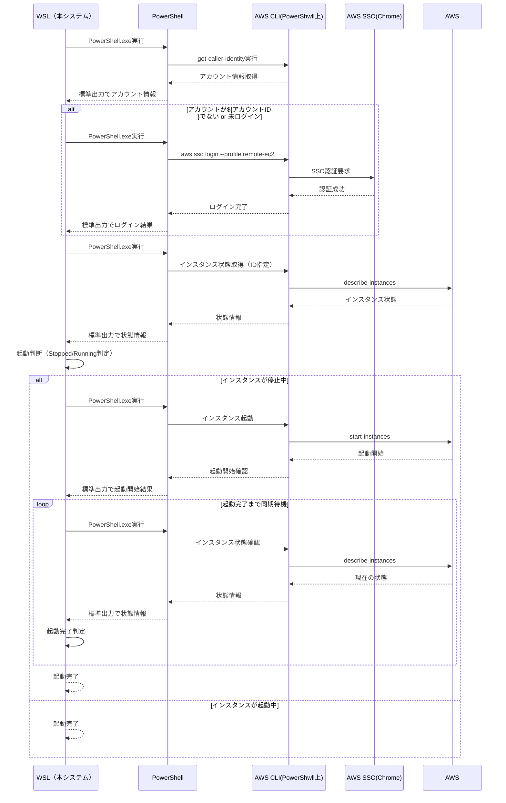

# AWS SSO EC2 起動シーケンス図

```mermaid
sequenceDiagram
    participant WSL as WSL（本システム）
    participant PS as PowerShell
    participant AWS as AWS CLI(PowerShwll上)
    participant SSO as AWS SSO(Chrome)
    participant EC2 as AWS

    WSL->>PS: PowerShell.exe実行
    PS->>AWS: get-caller-identity実行
    AWS-->>PS: アカウント情報取得
    PS-->>WSL: 標準出力でアカウント情報
    
    alt アカウントが${アカウントID}でない or 未ログイン
        WSL->>PS: PowerShell.exe実行
        PS->>AWS: aws sso login --profile remote-ec2
        AWS->>SSO: SSO認証要求
        SSO-->>AWS: 認証成功
        AWS-->>PS: ログイン完了
        PS-->>WSL: 標準出力でログイン結果
    end
    
    WSL->>PS: PowerShell.exe実行
    PS->>AWS: インスタンス状態取得（ID指定）
    AWS->>EC2: describe-instances
    EC2-->>AWS: インスタンス状態
    AWS-->>PS: 状態情報
    PS-->>WSL: 標準出力で状態情報
    
    WSL->>WSL: 起動判断（Stopped/Running判定）
    
    alt インスタンスが停止中
        WSL->>PS: PowerShell.exe実行
        PS->>AWS: インスタンス起動
        AWS->>EC2: start-instances
        EC2-->>AWS: 起動開始
        AWS-->>PS: 起動開始確認
        PS-->>WSL: 標準出力で起動開始結果
        
        loop 起動完了まで同期待機
            WSL->>PS: PowerShell.exe実行
            PS->>AWS: インスタンス状態確認
            AWS->>EC2: describe-instances
            EC2-->>AWS: 現在の状態
            AWS-->>PS: 状態情報
            PS-->>WSL: 標準出力で状態情報
            WSL->>WSL: 起動完了判定
        end
        
        WSL-->>WSL: 起動完了
    else インスタンスが起動中
        WSL-->>WSL: 起動完了
    end
```